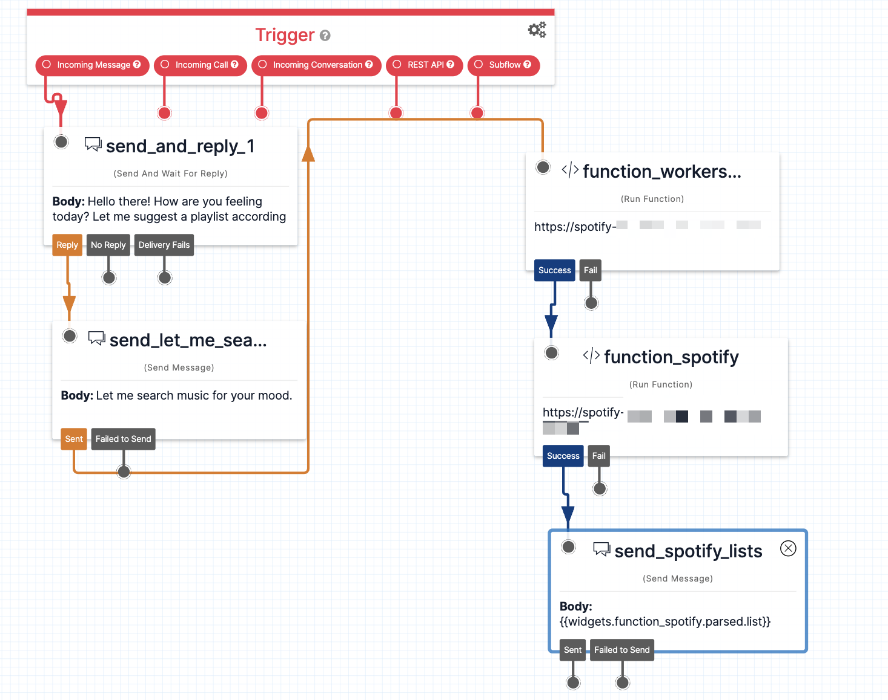

# Mood-Based Music: A WhatsApp Chatbot That Curates Personalized Playlists

*This is a submission for the [Twilio Challenge ](https://dev.to/challenges/twilio)*

## What I Built

I built a WhatsApp chatbot using Twilio that generates a personalized playlist of 5 songs based on the user's current mood. When a user sends a message to +1 (856) 975-0130 starting with "Hi", the bot prompts them to share how they are feeling. It then analyzes the sentiment of their response and curates a playlist to match their emotional state.

## Demo
You can try out the chatbot by sending a WhatsApp message to +1 (856) 975-0130 (You can use QR code below). Start your message with "Hi" and then share your current mood when prompted. The bot will respond with a playlist of 5 songs tailored to your emotional state.

## Twilio and AI
This project leverages Twilio's WhatsApp API to enable interactive chat and Twilio Studio & Twilio Functions to handle the chatbot logic. When a message is received from the user, it is forwarded to Cloudflare Workers AI for sentiment analysis.

Cloudflare Workers AI is used to perform sentiment analysis on the user's mood description. The AI model detects the sentiment of the text as positive, negative or neutral. Based on the detected mood, an appropriate search query is generated and sent to the Spotify API to retrieve a playlist of songs matching that emotional state. The playlist is then returned to the Twilio Function, which sends it back to the user via WhatsApp messages.

Twilio enabled quick development of the chat interface, while Cloudflare Workers AI allowed seamless analysis of the user's mood without needing to manage infrastructure. By leveraging AI capabilities, relevant Spotify queries could be generated to curate personalized playlists. Integrating these technologies resulted in an engaging, mood-based music recommendation experience delivered through WhatsApp.

### Twilio Studio Flow

### Twilio Functions Code
[GitHub Repository](https://github.com/irensaltali/dev.to-twilio-challenge-spotify)

## Additional Prize Categories

- Entertaining Endeavors: This chatbot provides a fun and interactive way to discover music that resonates with your current mood.
- Twilio Times Two: This app uses Twilio's WhatsApp API, Twilio Studio for workflow automation, Twilio Functions to create a conversational experience that generates personalized playlists based on the user's mood, and Twilio CLI for building and deploying the project.
  
<!-- Does your submission qualify for any additional prize categories (Twilio Times Two, Impactful Innovators, Entertaining Endeavors)? Please list all that apply.  -->

<!-- Team Submissions: Please pick one member to publish the submission and credit teammates by listing their DEV usernames directly in the body of the post. -->

<!-- Don't forget to add a cover image (if you want). -->

<!-- Thanks for participating! →
